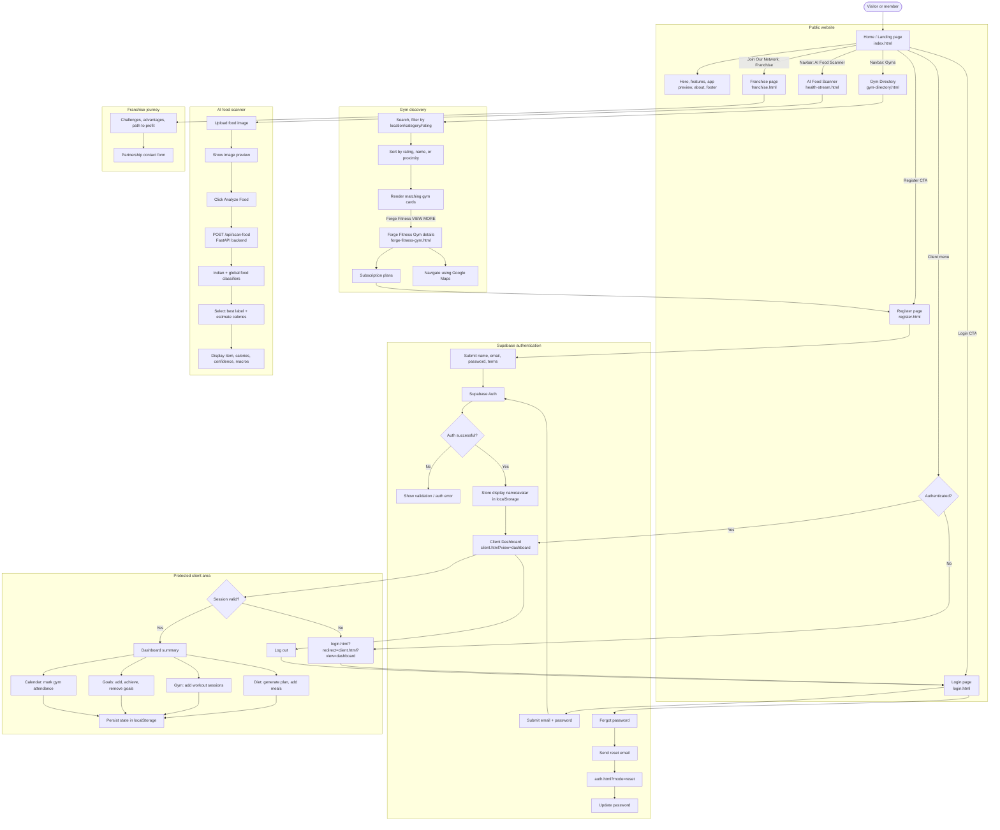
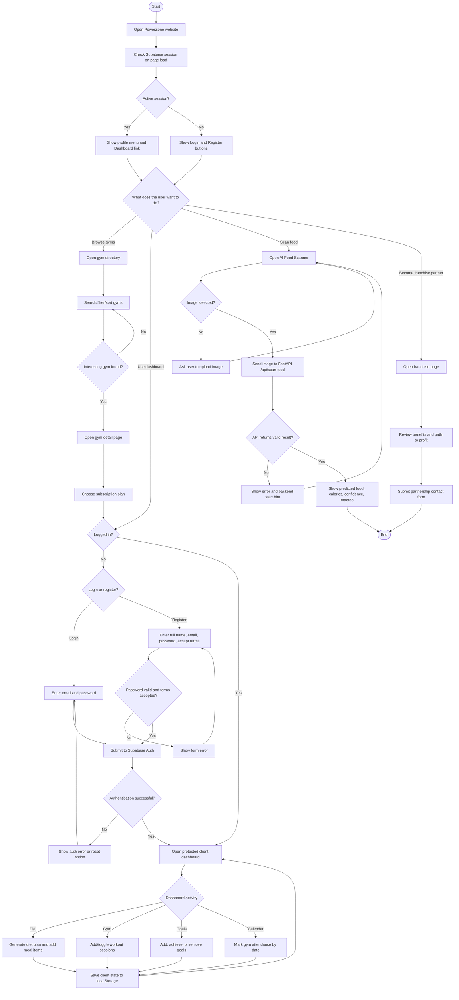
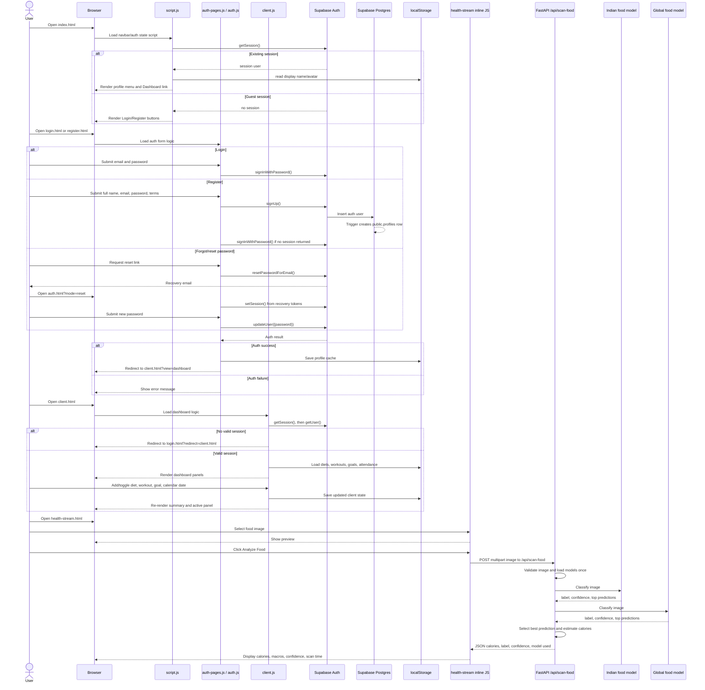

# PowerZone Mermaid Diagrams

Paste each Mermaid block into Mermaid AI / Mermaid Live Editor.

## 1. Website Flowchart

```mermaid
flowchart TD
    User([Visitor or member]) --> Home["Home / Landing page<br/>index.html"]

    subgraph Public["Public website"]
        Home --> HomeSections["Hero, features, app preview, about, footer"]
        Home -->|Navbar: Gyms| GymDirectory["Gym Directory<br/>gym-directory.html"]
        Home -->|Navbar: AI Food Scanner| FoodScanner["AI Food Scanner<br/>health-stream.html"]
        Home -->|Join Our Network: Franchise| Franchise["Franchise page<br/>franchise.html"]
        Home -->|Login CTA| Login["Login page<br/>login.html"]
        Home -->|Register CTA| Register["Register page<br/>register.html"]
        Home -->|Client menu| ClientGate{"Authenticated?"}
    end

    ClientGate -->|No| LoginRedirect["login.html?redirect=client.html?view=dashboard"]
    ClientGate -->|Yes| ClientDashboard["Client Dashboard<br/>client.html?view=dashboard"]
    LoginRedirect --> Login

    subgraph Auth["Supabase authentication"]
        Login --> LoginSubmit["Submit email + password"]
        Register --> RegisterSubmit["Submit name, email, password, terms"]
        Login --> Forgot["Forgot password"]
        Forgot --> ResetEmail["Send reset email"]
        ResetEmail --> ResetPage["auth.html?mode=reset"]
        ResetPage --> NewPassword["Update password"]
        LoginSubmit --> SupabaseAuth["Supabase Auth"]
        RegisterSubmit --> SupabaseAuth
        SupabaseAuth --> AuthResult{"Auth successful?"}
        AuthResult -->|No| AuthError["Show validation / auth error"]
        AuthResult -->|Yes| ProfileCache["Store display name/avatar in localStorage"]
        ProfileCache --> ClientDashboard
    end

    subgraph Client["Protected client area"]
        ClientDashboard --> SessionCheck{"Session valid?"}
        SessionCheck -->|No| LoginRedirect
        SessionCheck -->|Yes| DashboardView["Dashboard summary"]
        DashboardView --> DietView["Diet: generate plan, add meals"]
        DashboardView --> GymView["Gym: add workout sessions"]
        DashboardView --> GoalsView["Goals: add, achieve, remove goals"]
        DashboardView --> CalendarView["Calendar: mark gym attendance"]
        DietView --> LocalStorage["Persist state in localStorage"]
        GymView --> LocalStorage
        GoalsView --> LocalStorage
        CalendarView --> LocalStorage
        ClientDashboard --> Logout["Log out"]
        Logout --> Login
    end

    subgraph Gyms["Gym discovery"]
        GymDirectory --> SearchFilter["Search, filter by location/category/rating"]
        SearchFilter --> SortResults["Sort by rating, name, or proximity"]
        SortResults --> Results["Render matching gym cards"]
        Results -->|Forge Fitness VIEW MORE| Forge["Forge Fitness Gym details<br/>forge-fitness-gym.html"]
        Forge --> Plans["Subscription plans"]
        Plans --> Register
        Forge --> Maps["Navigate using Google Maps"]
    end

    subgraph Food["AI food scanner"]
        FoodScanner --> Upload["Upload food image"]
        Upload --> Preview["Show image preview"]
        Preview --> Analyze["Click Analyze Food"]
        Analyze --> FoodAPI["POST /api/scan-food<br/>FastAPI backend"]
        FoodAPI --> MLModels["Indian + global food classifiers"]
        MLModels --> Calories["Select best label + estimate calories"]
        Calories --> ScannerResult["Display item, calories, confidence, macros"]
    end

    subgraph Partner["Franchise journey"]
        Franchise --> PartnerContent["Challenges, advantages, path to profit"]
        PartnerContent --> ApplyForm["Partnership contact form"]
    end
```

## 2. Activity Diagram

```mermaid
flowchart TD
    Start([Start]) --> LoadSite["Open PowerZone website"]
    LoadSite --> CheckSession["Check Supabase session on page load"]
    CheckSession --> SessionDecision{"Active session?"}
    SessionDecision -->|Yes| AuthNav["Show profile menu and Dashboard link"]
    SessionDecision -->|No| GuestNav["Show Login and Register buttons"]

    AuthNav --> ChooseGoal{"What does the user want to do?"}
    GuestNav --> ChooseGoal

    ChooseGoal -->|Browse gyms| GymSearch["Open gym directory"]
    GymSearch --> ApplyFilters["Search/filter/sort gyms"]
    ApplyFilters --> GymFound{"Interesting gym found?"}
    GymFound -->|No| ApplyFilters
    GymFound -->|Yes| OpenGym["Open gym detail page"]
    OpenGym --> Subscribe["Choose subscription plan"]
    Subscribe --> NeedAccount{"Logged in?"}

    ChooseGoal -->|Use dashboard| NeedAccount
    NeedAccount -->|No| AuthChoice{"Login or register?"}
    AuthChoice -->|Login| EnterLogin["Enter email and password"]
    AuthChoice -->|Register| EnterRegister["Enter full name, email, password, accept terms"]
    EnterLogin --> SubmitAuth["Submit to Supabase Auth"]
    EnterRegister --> ValidateRegister{"Password valid and terms accepted?"}
    ValidateRegister -->|No| ShowAuthError["Show form error"]
    ShowAuthError --> EnterRegister
    ValidateRegister -->|Yes| SubmitAuth
    SubmitAuth --> AuthOk{"Authentication successful?"}
    AuthOk -->|No| ShowLoginError["Show auth error or reset option"]
    ShowLoginError --> EnterLogin
    AuthOk -->|Yes| OpenDashboard["Open protected client dashboard"]

    NeedAccount -->|Yes| OpenDashboard
    OpenDashboard --> DashboardAction{"Dashboard activity"}
    DashboardAction -->|Diet| GenerateDiet["Generate diet plan and add meal items"]
    DashboardAction -->|Gym| TrackWorkout["Add/toggle workout sessions"]
    DashboardAction -->|Goals| ManageGoals["Add, achieve, or remove goals"]
    DashboardAction -->|Calendar| MarkAttendance["Mark gym attendance by date"]
    GenerateDiet --> SaveState["Save client state to localStorage"]
    TrackWorkout --> SaveState
    ManageGoals --> SaveState
    MarkAttendance --> SaveState
    SaveState --> OpenDashboard

    ChooseGoal -->|Scan food| Scanner["Open AI Food Scanner"]
    Scanner --> SelectImage{"Image selected?"}
    SelectImage -->|No| UploadPrompt["Ask user to upload image"]
    UploadPrompt --> Scanner
    SelectImage -->|Yes| RunInference["Send image to FastAPI /api/scan-food"]
    RunInference --> ApiOk{"API returns valid result?"}
    ApiOk -->|No| ScannerError["Show error and backend start hint"]
    ScannerError --> Scanner
    ApiOk -->|Yes| ShowNutrition["Show predicted food, calories, confidence, macros"]
    ShowNutrition --> End([End])

    ChooseGoal -->|Become franchise partner| Franchise["Open franchise page"]
    Franchise --> ReadPartnerInfo["Review benefits and path to profit"]
    ReadPartnerInfo --> SubmitPartnerForm["Submit partnership contact form"]
    SubmitPartnerForm --> End
```

## 3. Sequence Diagram

```mermaid
sequenceDiagram
    actor U as User
    participant B as Browser
    participant Nav as script.js
    participant AuthJS as auth-pages.js / auth.js
    participant ClientJS as client.js
    participant SB as Supabase Auth
    participant DB as Supabase Postgres
    participant LS as localStorage
    participant ScanJS as health-stream inline JS
    participant API as FastAPI /api/scan-food
    participant Indian as Indian food model
    participant Global as Global food model

    U->>B: Open index.html
    B->>Nav: Load navbar/auth state script
    Nav->>SB: getSession()
    alt Existing session
        SB-->>Nav: session user
        Nav->>LS: read display name/avatar
        Nav-->>B: Render profile menu and Dashboard link
    else Guest session
        SB-->>Nav: no session
        Nav-->>B: Render Login/Register buttons
    end

    U->>B: Open login.html or register.html
    B->>AuthJS: Load auth form logic
    alt Login
        U->>AuthJS: Submit email and password
        AuthJS->>SB: signInWithPassword()
    else Register
        U->>AuthJS: Submit full name, email, password, terms
        AuthJS->>SB: signUp()
        SB->>DB: Insert auth user
        DB-->>DB: Trigger creates public.profiles row
        AuthJS->>SB: signInWithPassword() if no session returned
    else Forgot/reset password
        U->>AuthJS: Request reset link
        AuthJS->>SB: resetPasswordForEmail()
        SB-->>U: Recovery email
        U->>B: Open auth.html?mode=reset
        AuthJS->>SB: setSession() from recovery tokens
        U->>AuthJS: Submit new password
        AuthJS->>SB: updateUser({password})
    end
    SB-->>AuthJS: Auth result
    alt Auth success
        AuthJS->>LS: Save profile cache
        AuthJS-->>B: Redirect to client.html?view=dashboard
    else Auth failure
        AuthJS-->>B: Show error message
    end

    U->>B: Open client.html
    B->>ClientJS: Load dashboard logic
    ClientJS->>SB: getSession(), then getUser()
    alt No valid session
        ClientJS-->>B: Redirect to login.html?redirect=client.html
    else Valid session
        ClientJS->>LS: Load diets, workouts, goals, attendance
        ClientJS-->>B: Render dashboard panels
        U->>ClientJS: Add/toggle diet, workout, goal, calendar date
        ClientJS->>LS: Save updated client state
        ClientJS-->>B: Re-render summary and active panel
    end

    U->>B: Open health-stream.html
    U->>ScanJS: Select food image
    ScanJS-->>B: Show preview
    U->>ScanJS: Click Analyze Food
    ScanJS->>API: POST multipart image to /api/scan-food
    API->>API: Validate image and load models once
    API->>Indian: Classify image
    Indian-->>API: label, confidence, top predictions
    API->>Global: Classify image
    Global-->>API: label, confidence, top predictions
    API->>API: Select best prediction and estimate calories
    API-->>ScanJS: JSON calories, label, confidence, model used
    ScanJS-->>B: Display calories, macros, confidence, scan time
```
